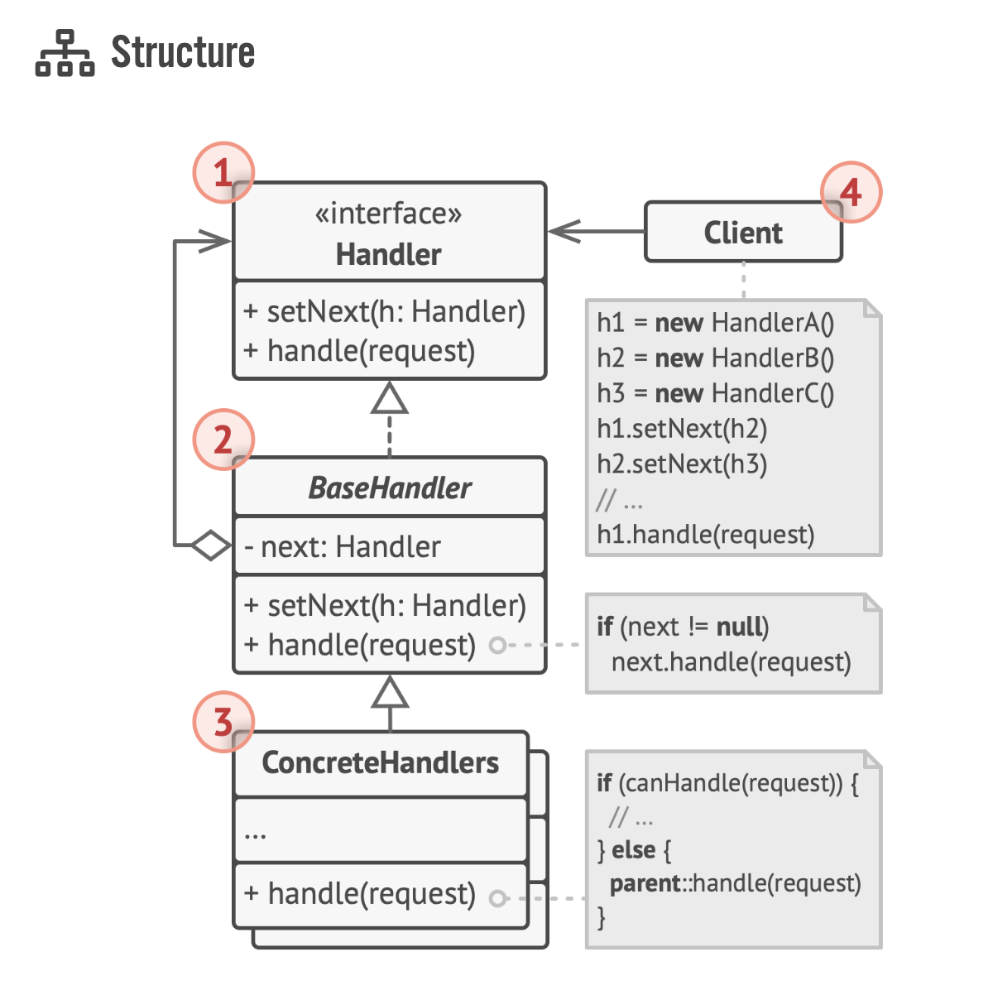

# Chain Responsibility Pattern




1. The Handler declares the interface, common for all concrete handlers. It usually contains just a single method for handling requests, but sometimes it may also have another method for setting the next handler on the chain.
2. The Base Handler is an optional class where you can put the boilerplate code that’s common to all handler classes. Usually, this class defines a field for storing a reference to the next handler. The clients can build a chain by passing a han- dler to the constructor or setter of the previous handler. The class may also implement the default handling behavior: it can pass execution to the next handler after checking for its existence.
3. Concrete Handlers contain the actual code for processing requests. Upon receiving a request, each handler must decide whether to process it and, additionally, whether to pass it along the chain. Handlers are usually self-contained and immutable, accepting all necessary data just once via the constructor.
4. The Client may compose chains just once or compose them dynamically, depending on the application’s logic. Note that a request can be sent to any handler in the chain—it doesn’t have to be the first one.

## Exercise 1: HTTP Request Handler
Create a chain of handlers to process HTTP requests. Each handler should be capable of processing different aspects of an HTTP request, such as authentication, logging, data sanitization, etc. The request should only reach the final handler (which handles the business logic) if it successfully passes through all the preceding handlers.

- Authenticator: Checks if the request contains valid credentials.
- Logger: Logs details of the request.
- Sanitizer: Cleans data inputs to prevent SQL injection or other attacks.
- Business Handler: Processes the request after all security checks and logging are done.

Execution Example:

```go
func main() {
    authenticator := NewAuthenticator(nil)
    logger := NewLogger(authenticator)
    sanitizer := NewSanitizer(logger)
    businessHandler := NewBusinessHandler(sanitizer)

    httpReq := NewHTTPRequest("/api/data", "GET", "user=test&pass=1234")
    businessHandler.Handle(httpReq)
}
```

## Exercise 2: Image Processing Pipeline
Imagine you are building an image editing software and need to apply a series of filters to an image sequentially. Implement a chain of filters where each filter alters the image in some way before passing it on to the next filter in the chain.

Grayscale Filter: Converts the image to grayscale.
Edge Detection Filter: Detects and highlights the edges in the image.
Blur Filter: Applies a blurring effect to the image.
Contrast Filter: Adjusts the image's contrast.
Execution Example:

```go
func main() {
    image := loadImage("path/to/image.jpg")
    grayscaleFilter := NewGrayscaleFilter(nil)
    edgeFilter := NewEdgeDetectionFilter(grayscaleFilter)
    blurFilter := NewBlurFilter(edgeFilter)
    contrastFilter := NewContrastFilter(blurFilter)

    processedImage := contrastFilter.Apply(image)
    saveImage(processedImage, "path/to/processed_image.jpg")
}
```

## Exercise 3: Contextual Help System
Imagine you are designing a contextual help system for a software application. When a user requests help, the request should pass through a chain of handlers that determine the best way to provide the needed assistance.

Field Help: If the help request is related to a specific field, provides a detailed explanation of that field.
Form Help: If the request cannot be handled at the field level, provides help for the entire form.
General Help: If the request cannot be handled at the form level, provides a general guide to the application.
Customer Support: If help cannot be provided through automated means, pass the request to the customer support team.
Execution Example:

```go
func main() {
    fieldHelp := NewFieldHelp(nil)
    formHelp := NewFormHelp(fieldHelp)
    generalHelp := NewGeneralHelp(formHelp)
    customerSupport := NewCustomerSupport(generalHelp)

    helpRequest := NewHelpRequest("How do I submit the form?")
    customerSupport.Handle(helpRequest)
}
```

For each of these exercises, you should define a Handler interface with a Handle method that receives the request and optionally returns a response or result. Then, implement several structs that satisfy this interface, each representing a handler in the chain. Each handler should have a reference to the next handler in the chain and should be able to pass the request along if it cannot fully handle it by itself.
